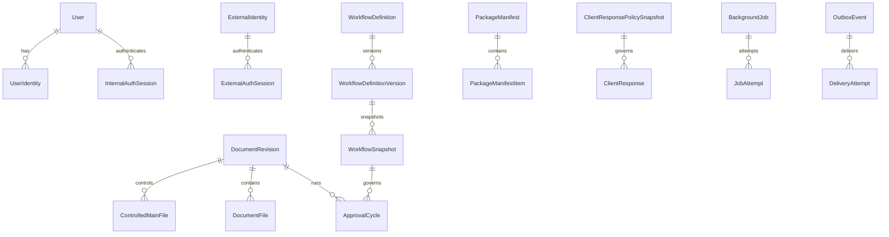

# Data Model

Date: 2026-07-30

The authoritative model is `prisma/schema.prisma`. PostgreSQL is the only
application database and Prisma is the only ORM and migration authority.

## Persistence Rules

Identity links, sessions, roles, project scope, workflows, manifests, approval
evidence, client responses, requests, jobs, and audit records are PostgreSQL
data. File rows contain provider-neutral storage provider/key pairs, immutable
identities where applicable, hashes, media metadata, and lifecycle state.
Large file bytes remain outside PostgreSQL.

## Database-Enforced Invariants

- One active controlled Main PDF per revision.
- One active approval cycle per revision.
- Published workflow, cover, response-code, and request-form versions are
  immutable.
- Audit, page-event, evidence, and mapping histories are append-only for normal
  runtime operations.
- Google subjects are immutable after linking.
- Session, invitation, quorum, upload, and review-page bounds are checked.

## Baseline

`prisma/migrations/0001_initial_dtg_signature_platform/migration.sql` creates
the complete schema and reviewed PostgreSQL-only triggers, functions, checks,
partial indexes, foreign keys, and unique constraints.
