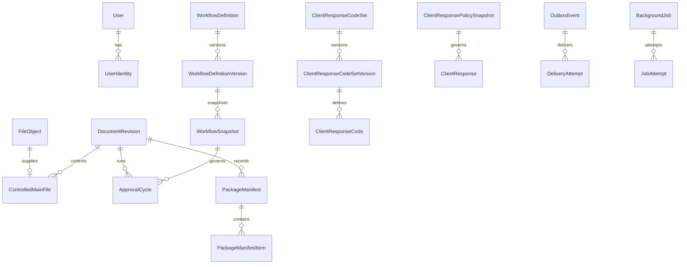

# Data Model

The schema contains legacy and target models together. Relations required by
Phase 3 enforcement are explicit; other future-domain references use immutable
scalar identifiers until their owning runtime package is introduced.
