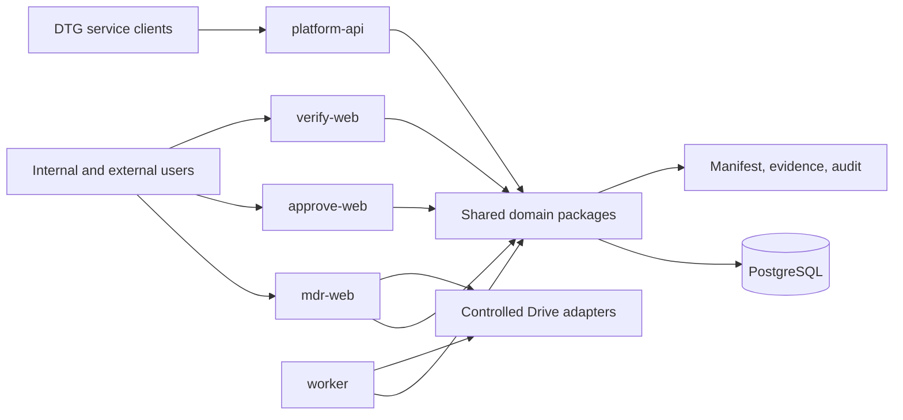

# Graphify Final

Date: 2026-07-29

## Comparison

| Metric        | Baseline | Final |
| ------------- | -------: | ----: |
| Nodes         |      976 | 3,761 |
| Edges         |    2,709 | 6,732 |
| Communities   |       72 |   353 |
| Import cycles |        0 |     0 |

The baseline was a code-only graph at commit
`05eb730a8f7e735a1254c1d1ba7e3133775d5ddc`. The final graph uses deterministic
AST extraction. An approved semantic backend was not configured, so semantic
claims are not fabricated.

The final graph contains 2,785 more nodes, 4,023 more edges, and 281 more
communities because the repository now contains five functional applications,
nineteen packages, twelve migrations, durable operations, and phase evidence.
The architecture validator separately confirms five application boundaries,
nineteen packages, zero workspace cycles, no private package-source imports,
and no application-to-application imports.

## Final Architecture

## Coupling Assessment

- Authentication remains an MDR composition concern, but identity contracts and
  policy are extracted into `@dtg/identity-domain`.
- Prisma remains central at service composition roots; shared database creation
  is isolated in `@dtg/database` and application-to-application imports are
  forbidden.
- Workflow policy is extracted into `@dtg/workflow-engine-domain`; transactions
  remain in MDR services and the legacy adapter is intentionally retained.
- Controlled storage contracts are extracted, while Supabase compatibility and
  live provider orchestration remain MDR/worker composition concerns.
- PDF contracts and assembly policy are in `@dtg/pdf-engine`; legacy template
  rendering remains an application compatibility path.
- The architecture checker reports package cycles, application imports, private
  source imports, and route parity violations as failures.

`requireCurrentAppUser()` increased from 99 baseline edges to 125 final edges.
This is not claimed as coupling reduction: the authenticated MDR surface grew
substantially. The security benefit is centralized server-side enforcement,
while the remaining migration debt is to split session resolution from
application read models after legacy authentication retirement.

The final top structural hubs include `cn()` at 131 edges,
`requireCurrentAppUser()` at 125, and `assertUserHasAnyPermission()` at 47.
UI utility centrality is graph noise; the two authorization hubs remain the
important architectural review points.

## Remaining Debt

The graph will continue to show high centrality around authentication, Prisma,
storage, and workflow orchestration until production cutover removes legacy
consumers. That is known migration coupling, not grounds for unsafe deletion.
