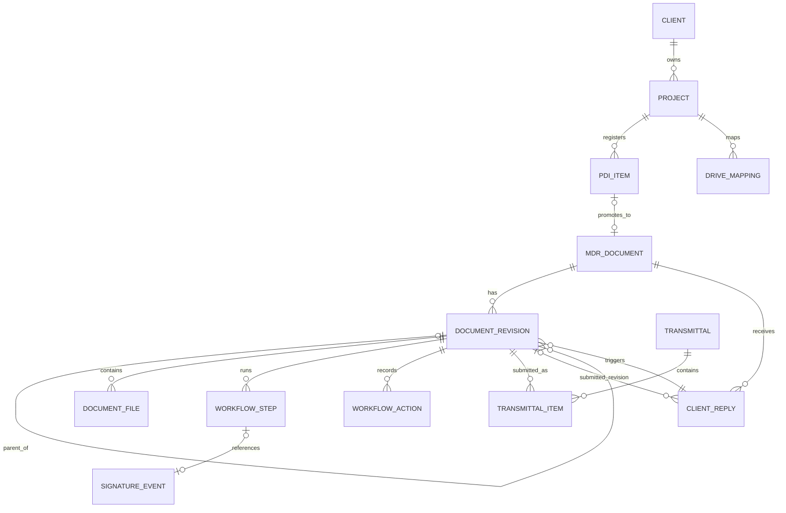
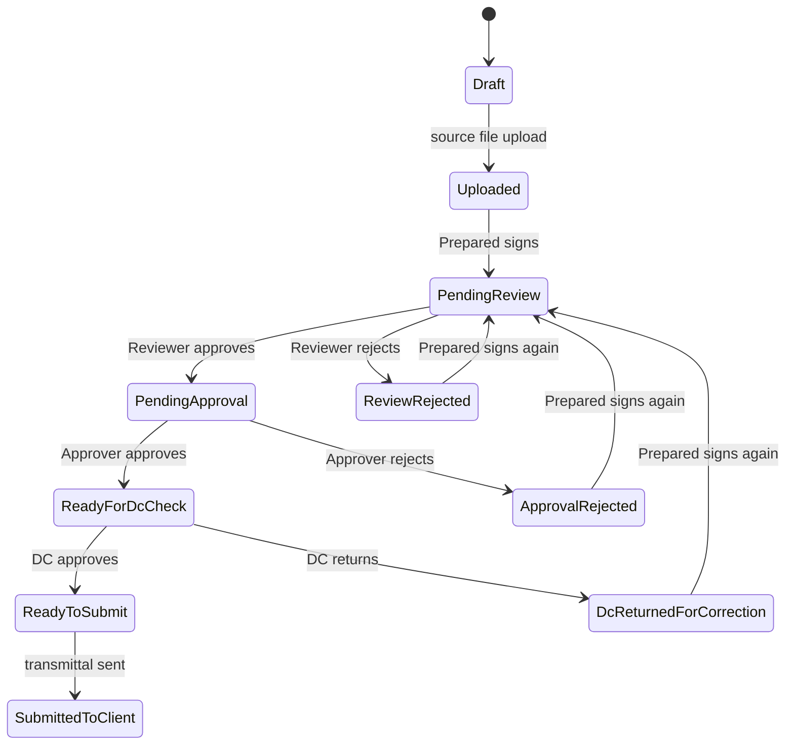

# MDR Code Merge-Readiness Report

Audit date: 2026-07-29  
Repository: `moabuomar1889/dtgsa-mdr`  
Branch: `codex/foundation-bootstrap`  
Commit inspected: `05eb730a8f7e735a1254c1d1ba7e3133775d5ddc`  
Scope: focused, code-only merge-readiness inspection

## 1. Executive Summary

The repository is a working full-stack Next.js application, not a UI-only mock. It has real server-side services for PDI, MDR document and revision management, fixed internal approvals, file upload, PDF generation, transmittals, client replies, notifications, search, reporting, and audit logging. The application is organized into service modules but is deployed as one Next.js monolith with one Prisma/PostgreSQL schema.

The strongest reusable assets are the MDR/PDI domain model, numbering logic, revision lineage, review-code precedence, transmittal and reply flows, role/permission vocabulary, PDF utility functions, template lookup rules, and audit/event concepts. These should be preserved while their storage, workflow, identity, and signing boundaries are redesigned.

The current code does not satisfy the future platform's core trust model. Authentication is Supabase password-based rather than Google Workspace SSO. Approval steps are hardcoded. There is no central approval application, verification portal, Google Picker, configurable sequential/parallel workflow engine, exact-document review proof, canonical package manifest/hash, cryptographic platform seal, QR verification, visual cover designer, or reusable cross-application signing engine.

The current `SignatureEvent.signatureHash` is a SHA-256 hash of user ID, revision ID, step type, and timestamp. It does not bind the approval to the main-file checksum, canonical package hash, workflow snapshot, Google identity, or a central DTG signing key. The visible signature is an uploaded image. It is not a digital PDF signature or independently verifiable cryptographic evidence.

**Recommendation:** use Option C, an incremental modular monorepo. Keep the current MDR application operational while extracting shared domain packages and introducing separate approval, verification, API, and worker applications. A big-bang rewrite is not justified, but directly embedding all new signing capabilities into the current monolith would preserve the wrong coupling.

**Merge-readiness verdict:** ready for controlled domain reuse and staged extraction; not ready for a direct code merge into the target signature platform without an additive schema, contract, identity, workflow, file-control, and evidence redesign.

## 2. Actual Repository Architecture

### Classification

- **Working full-stack application:** yes.
- **Modular application:** partially. Services and actions are grouped by domain.
- **Deployment architecture:** monolith. UI, server actions, API route, PDF work, email delivery, storage operations, and database access execute in one Next.js process.
- **Partially scaffolded prototype:** some administration and configuration surfaces remain incomplete, but core document flows have real implementation.

### Technology

| Layer                     | Actual implementation                                             |
| ------------------------- | ----------------------------------------------------------------- |
| Web framework             | Next.js `16.2.1`, React `19.2.4`, App Router                      |
| Language                  | TypeScript `5.9.3`                                                |
| Database                  | PostgreSQL through Prisma `7.6.0` and `@prisma/adapter-pg`        |
| Authentication            | Supabase Auth through `@supabase/ssr` and `@supabase/supabase-js` |
| Primary object storage    | Supabase Storage                                                  |
| Secondary document mirror | Google Drive API through `googleapis` and a service account/JWT   |
| PDF                       | `pdf-lib`                                                         |
| DOCX templates            | `docxtemplater`, `pizzip`, LibreOffice headless conversion        |
| Excel                     | `xlsx`                                                            |
| Email                     | SMTP or Resend through `nodemailer`/HTTP                          |
| Validation                | Zod                                                               |
| UI                        | Tailwind CSS, shadcn/radix-ui, React Hook Form                    |

### Runtime Flow

```mermaid
flowchart LR
    U[Browser] --> R[Next.js App Router pages]
    U --> A[Server Actions]
    U --> X[/api/pdi/export]
    R --> S[Domain-oriented server services]
    A --> S
    X --> S
    S --> P[Prisma]
    P --> DB[(PostgreSQL)]
    S --> SA[Supabase Auth]
    S --> SS[Supabase Storage]
    S --> GD[Google Drive API]
    S --> PDF[pdf-lib / DOCX / LibreOffice]
    S --> EM[SMTP or Resend]
```

### Important Architectural Observations

- Server Components load overview/query services; interactive forms call Server Actions.
- There is only one HTTP API route, `src/app/api/pdi/export/route.ts`. Most write operations are Server Actions.
- Prisma is called directly by services; there is no stable external platform API or domain-event boundary.
- PDF generation and email delivery run in request scope. There is no durable worker or job queue.
- Google Drive upload failures are logged and treated as optional; Supabase remains authoritative.
- No Docker, Coolify, CI workflow, health endpoint, worker deployment, or observability configuration was found.

## 3. Implemented Module Matrix

Status reflects executable code, not README claims or schema-only concepts.

| Module                       | Status                | Evidence                                                                                | Usable now                                                                   | Merge disposition                                                               |
| ---------------------------- | --------------------- | --------------------------------------------------------------------------------------- | ---------------------------------------------------------------------------- | ------------------------------------------------------------------------------- |
| Authentication               | PARTIALLY_IMPLEMENTED | `auth-service.ts`, `auth.ts`, `sign-in/page.tsx`                                        | Yes, with Supabase password auth                                             | REPLACE identity entry point; preserve session-facing abstractions where useful |
| Users                        | PARTIALLY_IMPLEMENTED | `User`, `user-sync-service.ts`, `admin/users/page.tsx`                                  | List/sync/profile are usable; lifecycle administration is incomplete         | KEEP AND MODIFY                                                                 |
| Roles and permissions        | IMPLEMENTED           | `rbac.ts`, `permission-service.ts`, seed roles, `Role`, `Permission`                    | Server-side checks are used in core actions                                  | KEEP AND MODIFY for Google groups and separation-of-duties rules                |
| Clients                      | PARTIALLY_IMPLEMENTED | `client-management.ts`, `clients/page.tsx`, `Client`                                    | Create/list works; contacts/settings management is incomplete                | KEEP AND MODIFY                                                                 |
| Projects                     | PARTIALLY_IMPLEMENTED | `project-management.ts`, project pages, `Project`                                       | Create/list/dashboard and Drive-folder onboarding exist                      | KEEP AND MODIFY                                                                 |
| Master data                  | PARTIALLY_IMPLEMENTED | `master-data-service.ts`, `masters/page.tsx`                                            | Global create/list exists; broader scoped lifecycle management is incomplete | KEEP AND MODIFY                                                                 |
| PDI                          | IMPLEMENTED           | `pdi-service.ts`, `pdi/page.tsx`, `PdiRegister`, `PdiItem`                              | Core create/status/client-number flow exists                                 | KEEP AS-IS initially                                                            |
| PDI Excel import/export      | IMPLEMENTED           | `pdi-excel-service.ts`, `pdi-import.ts`, `/api/pdi/export`                              | Real workbook import/export code exists                                      | KEEP AS-IS initially                                                            |
| PDI-to-MDR conversion        | IMPLEMENTED           | `promotePdiItemToMdr`, `pdi.ts`                                                         | Creates document, first revision, and workflow steps                         | KEEP AND MODIFY to call the new workflow factory                                |
| MDR documents                | IMPLEMENTED           | `mdr-service.ts`, `mdr/page.tsx`, `MdrDocument`                                         | Core overview and actions exist                                              | KEEP AND MODIFY                                                                 |
| Revisions                    | IMPLEMENTED           | `DocumentRevision`, `recordClientReply`                                                 | Same-number revision and replacement-number flows exist                      | KEEP AND MODIFY                                                                 |
| File upload                  | IMPLEMENTED           | `uploadRevisionFile`, `storage-service.ts`                                              | Supabase upload and optional Drive mirror work in code                       | REPLACE storage authority; reuse validation/checksum logic                      |
| Google Drive file selection  | ABSENT                | No Picker component, route, or Picker API use                                           | No                                                                           | BUILD NEW                                                                       |
| Google Drive File ID storage | PARTIALLY_IMPLEMENTED | `DocumentFile.googleDriveFileId`, `GeneratedDocument.googleDriveFileId`, `DriveMapping` | IDs are stored after optional mirror uploads                                 | KEEP AND MODIFY so Drive ID is authoritative                                    |
| Source-file storage          | IMPLEMENTED           | `DocumentFile`, `uploadRevisionFile`                                                    | Supabase is the primary source store                                         | REPLACE primary storage policy with controlled Drive                            |
| Cover generation             | PARTIALLY_IMPLEMENTED | `cover-sheet-service.ts`, `template-management-service.ts`                              | Fallback PDFs work; DOCX templates depend on LibreOffice                     | KEEP AND MODIFY                                                                 |
| PDF merging                  | IMPLEMENTED           | `mergePdfBuffers`, `generateMergedRevisionPackage`                                      | Real in-memory merge and persistent output                                   | KEEP AND MODIFY behind a PDF engine and cache policy                            |
| Internal review              | IMPLEMENTED           | `reviewRevision`, workflow actions/page forms                                           | Fixed reviewer step works                                                    | REPLACE orchestration; retain business terminology                              |
| Internal approval            | IMPLEMENTED           | `approveRevision`                                                                       | Fixed approver step works                                                    | REPLACE orchestration                                                           |
| Document Control check       | IMPLEMENTED           | `dcValidateRevision`                                                                    | Fixed DC check works                                                         | KEEP AND MODIFY as a configurable workflow gate                                 |
| Signatures                   | PARTIALLY_IMPLEMENTED | `SignatureProfile`, `SignatureEvent`, `buildSignatureHash`, cover rendering             | Visible images and event records exist                                       | REPLACE evidence generation; retain appearance assets carefully                 |
| Comments                     | PARTIALLY_IMPLEMENTED | `WorkflowStep.comments`, `WorkflowAction.comments`, `ClientReply.comments`              | Single action notes exist; no threaded/page-specific review comments         | KEEP AND MODIFY                                                                 |
| Returns and rejection        | PARTIALLY_IMPLEMENTED | review/approval reject paths, DC return, rejected reply file type                       | Fixed return states exist                                                    | KEEP AND MODIFY with approval-cycle/content invalidation rules                  |
| Transmittals                 | IMPLEMENTED           | `transmittal-service.ts`, transmittal page/forms, models                                | Draft, attachment selection, PDF generation, send state, optional email      | KEEP AND MODIFY                                                                 |
| Client replies               | IMPLEMENTED           | `client-reply-service.ts`, reply page/form, `ClientReply`                               | Reply recording and follow-up actions exist                                  | KEEP AND MODIFY                                                                 |
| Client response codes        | PARTIALLY_IMPLEMENTED | `ReviewCode`, `buildApplicableReviewCodes`, review-code form                            | Global/client/project precedence and three behavior flags exist              | KEEP AND MODIFY with versioned policy snapshots and richer effects              |
| Revision creation            | IMPLEMENTED           | `recordClientReply`, `getNextRevisionLabel`                                             | Same document number and new-number paths exist                              | KEEP AND MODIFY                                                                 |
| Search                       | IMPLEMENTED           | `global-search-service.ts`, `search/page.tsx`                                           | Queries multiple domain records                                              | KEEP AS-IS initially                                                            |
| Dashboard                    | IMPLEMENTED           | `dashboard-overview.ts`, dashboard page                                                 | Real aggregate queries and integration status                                | KEEP AS-IS initially                                                            |
| Notifications                | IMPLEMENTED           | `notification-service.ts`, notifications page                                           | In-app records and immediate email attempts exist                            | KEEP AND MODIFY with durable outbox/worker                                      |
| Reports                      | IMPLEMENTED           | `reporting-service.ts`, reports page                                                    | Real aggregate reporting queries exist                                       | KEEP AS-IS initially                                                            |
| Audit logs                   | IMPLEMENTED           | `AuditLog`, `audit-overview.ts`, writes across services                                 | Business events are recorded                                                 | KEEP AND MODIFY into immutable verification evidence                            |

No automated tests were found for any module, so "usable" means a real code path exists and compiles, not that end-to-end behavior is proven.

## 4. Major Routes and Services

### Routes

- Authentication: `/sign-in`
- Core work: `/dashboard`, `/tasks`, `/pdi`, `/mdr`, `/transmittals`, `/replies`
- Administration: `/admin/users`, `/clients`, `/projects`, `/projects/new`, `/projects/[projectId]`, `/masters`, `/templates`, `/settings`
- Supporting capabilities: `/profile`, `/notifications`, `/search`, `/reports`, `/audit`, `/pdf-tools`
- Client surface: `/portal`, `/portal/pdi`
- API: `/api/pdi/export`

### Server Actions

`src/server/actions/` contains actions for authentication, MDR files/packages, workflow decisions, PDI/import, platform administration, portal PDI updates, profile/signature assets, templates, transmittals, client replies, notifications, and PDF tools.

### Services

- Identity/access: `services/auth`, `services/admin`
- Document control: `services/pdi`, `services/mdr`, `services/workflow`, `services/transmittals`, `services/replies`
- Platform data: `services/clients`, `services/projects`, `services/masters`, `services/numbering`
- Files/output: `services/storage`, `services/drive`, `services/pdf`, `services/templates`, `services/signatures`
- Operations/read models: `services/dashboard`, `services/tasks`, `services/search`, `services/reports`, `services/audit`, `services/notifications`, `services/email`

Only client-reply and transmittal read paths currently have dedicated repository classes. Other services use Prisma directly.

## 5. Prisma and Database Summary

### Schema and Migration

- `prisma/schema.prisma` contains 22 enums and 42 models.
- One baseline migration exists: `prisma/migrations/20260329143000_init_foundation/migration.sql`.
- The migration creates 22 enum types and 42 tables, matching the schema counts and names.
- `prisma validate` passes.
- This is code-level alignment only. Live database drift was not checked because this was a code-only audit.
- Seed data exists in `scripts/seed-foundation.ts` and is exposed through `pnpm db:seed`.

### Important Models

- Identity and access: `User`, `Role`, `Permission`, `UserRole`, `UserProjectRole`, `RolePermission`
- Signature records: `SignatureProfile`, `SignatureEvent`
- Client/project configuration: `Client`, `ClientContact`, `ClientSetting`, `Project`, `ProjectContact`, `ProjectSetting`
- Discipline/master data: `Discipline`, `ClientDiscipline`, `ProjectDiscipline`, `ProjectDisciplineAssignment`, `DocumentTypeCategory`, `ReleasePurpose`, `ReviewCode`
- Numbering: `NumberingRule`, `NumberingRuleToken`, `NumberingSequence`
- PDI: `PdiRegister`, `PdiItem`
- MDR: `MdrDocument`, `DocumentRevision`, `DocumentFile`
- Workflow: `WorkflowStep`, `WorkflowAction`
- Templates/output: `CoverSheetTemplate`, `TransmittalTemplate`, `GeneratedDocument`
- Submission/reply: `Transmittal`, `TransmittalItem`, `ClientReply`
- Integration/operations: `DriveMapping`, `Notification`, `AuditLog`, `SystemLog`, `SystemSetting`

### Lifecycle Enums

- `PdiStatus`: Draft, SentToClient, ClientNumberPending, ClientNumberReceived, ConvertedToMdr, Archived
- `WorkflowStatus`: Draft, Uploaded, PendingReview, ReviewRejected, PendingApproval, ApprovalRejected, ReadyForDcCheck, DcReturnedForCorrection, ReadyToSubmit, SubmittedToClient
- `RevisionStatus`: Original, RevisionInProgress, Resubmitted, Superseded, Closed
- `ClientReplyState`: WaitingClientReply, ReplyReceived, RevisionRequired, NoFurtherSubmittal, InformationOnly
- `WorkflowStepType`: Prepared, Reviewed, Approved, DcCheck
- `WorkflowStepStatus`: Pending, Approved, Rejected, Skipped
- `WorkflowActionType`: Created, Uploaded, SubmittedForReview, ReviewApproved, ReviewRejected, SubmittedForApproval, ApprovalApproved, ApprovalRejected, ReturnedForCorrection, DcValidated, SubmittedToClient, ClientReplyRecorded, RevisionTriggered, Locked, Unlocked
- `TransmittalStatus`: Draft, ReadyToSend, Sent, Cancelled
- `ClientReplyNextAction`: REVISION_REQUIRED, NEW_DOCUMENT_NUMBER_REQUIRED, NO_FURTHER_ACTION
- File/output enums: `DocumentFileType`, `GeneratedDocumentKind`, `StorageProvider`, `DriveFolderType`, `CoverSheetKind`
- Operational enums: `NotificationChannel`, `NotificationStatus`, `AuditSeverity`, `SystemSeverity`
- Configuration enums: `ScopeLevel`, `NumberingSequenceScope`, `NumberingTokenType`, `DisciplineAssignmentType`

### Major Existing Relationships



### Explicit Merge Questions

| Question                                                        | Answer                                                                                                                                                                                |
| --------------------------------------------------------------- | ------------------------------------------------------------------------------------------------------------------------------------------------------------------------------------- |
| Can `MdrDocument` and `DocumentRevision` be retained?           | Yes. Their identity, current-revision pointer, same-number lineage, and reply linkage are useful. Add content/package/workflow snapshot relations rather than replacing the concepts. |
| Can one revision contain multiple internal approval cycles?     | No. `WorkflowStep` is unique by revision and step type. There is no approval-cycle entity or step-instance version.                                                                   |
| Can one revision contain multiple client submissions?           | Yes structurally. It can appear in multiple transmittals because uniqueness is per transmittal/revision pair. Submission-cycle metadata is still insufficient.                        |
| Can one revision contain multiple client responses?             | Yes. `ClientReply` is one-to-many from document/revision with no one-response constraint.                                                                                             |
| Can Package Manifest and Package Hash be added cleanly?         | Yes. Add package/manifest/file/evidence tables linked to `DocumentRevision` and approval cycle. Avoid overloading `GeneratedDocument`.                                                |
| Can Google Drive File ID become the primary external reference? | Yes, but `DocumentFile` must enforce provider identity, immutable Drive ID/version/checksum metadata, and stop treating Supabase path as authoritative.                               |

### Tables to Add

- `ApprovalCycle`
- `WorkflowDefinition`, `WorkflowDefinitionVersion`, `WorkflowSnapshot`
- `WorkflowStepInstance`, `WorkflowAssignment`, `WorkflowParallelGroup`
- `DocumentContentVersion` or an explicit immutable revision main-file record
- `PackageManifest`, `PackageManifestFile`, `PackageHash`
- `ApprovalEvidence`, `PlatformSeal`, `VerificationRecord`
- `ReviewSession` and exact-document/page-view evidence
- `CoverTemplateVersion`, `CoverLayoutElement`, `SignatureBox`, `TemplateBinding`
- `ClientResponsePolicyVersion` and response-policy snapshots
- `OutboxEvent`, `BackgroundJob`, `DeliveryAttempt`

### Tables to Change

- `User`: add immutable Google subject, Workspace domain, identity status, and group-sync metadata.
- `DocumentRevision`: link the authoritative main content, active approval cycle, workflow snapshot, and canonical package manifest.
- `DocumentFile`: make Drive file ID/version the authoritative external identity; keep checksum, media type, and controlled-location metadata immutable per version.
- `WorkflowStep`: replace fixed unique step types with versioned step instances and assignment/quorum rules.
- `SignatureEvent`: retain as legacy history or migrate to `ApprovalEvidence`; bind evidence to file/package/workflow hashes and platform seal.
- `ClientReply`: snapshot response-code semantics and preserve returned-file role/type explicitly.
- `AuditLog`: make evidence events append-only and link them to verification records.

### Underused, Duplicate, or Obsolete Concepts

- No core table is proven obsolete.
- `ProjectContact`, `ClientDiscipline`, `ProjectDiscipline`, and `ProjectDisciplineAssignment` have no active service flow beyond schema relations.
- `ClientContact` is counted in the client overview but has no CRUD service.
- `ClientSetting` and `ProjectSetting` are read by upload/transmittal/rejected-file policies but have no complete management workflow.
- `DocumentFile` and `GeneratedDocument` overlap in storage metadata, but represent attached files versus generated outputs. They should be unified behind a shared immutable file-object concept rather than deleted blindly.

## 6. Current Workflow

### Implemented State Machine

The requested current sequence exists in executable server code:



### Enforcement

- Fixed step definitions are in `src/server/services/workflow/workflow-service.ts`: Prepared, Reviewed, Approved, DcCheck with orders 1-4.
- Transition guards and lock logic are in `src/lib/workflow/constants.ts`.
- Permission checks execute server-side using system/project roles.
- Workflow writes use Prisma transactions.
- Client submission is enforced in `sendTransmittal`; client replies require `SubmittedToClient`.

### Limitations

- Steps and transitions are hardcoded, not configurable.
- Sequential approval exists; parallel approvals and quorum rules do not.
- Multiple managers or multiple instances of the same step are not supported.
- `assignedUserId` exists, but current orchestration primarily authorizes by role/permission. There is no complete person/group/department assignment engine.
- The same person can perform multiple steps if granted multiple permissions; separation of duties is not enforced.
- Previous `WorkflowAction` and `SignatureEvent` rows remain, but a fixed `WorkflowStep` record is updated and can point to a later signature event.
- Internal returns keep the same external revision; a client-required content change creates a new revision and new steps.
- Uploading or regenerating content does not create an immutable content version that automatically invalidates prior approvals.
- Transactions are present, but approval functions do not use compare-and-set status updates or idempotency keys. Concurrent repeated requests can race.

### Required Workflow-Engine Changes

Create immutable workflow-definition versions and per-revision snapshots. Each approval cycle must own step instances, assignments, sequence/parallel groups, quorum, decisions, content/package hash, and status. Any changed main-file hash must close or invalidate the current cycle and create a new cycle from the first configured step. Decision commands must be idempotent and conditionally update the expected current state.

## 7. Current File and PDF Model

### Storage and Identity

- Supabase Storage is the primary store for source, generated, signature, and temporary files.
- `DocumentFile` stores Supabase bucket/path, filename, size, MIME type, checksum, and optional Google Drive file/folder IDs.
- Google Drive integration is real. `project-drive-service.ts` creates standard project folders and uploads files using the Drive API.
- Google Drive is currently an optional mirror. Upload failures are logged and return `null`.
- Project onboarding can discover or accept a Drive folder ID, but there is no Google Picker.
- Storage paths and filenames are used to construct object keys and labels. Drive IDs are stored but are not the primary authority.

### Current Copy Behavior

- Source upload creates one Supabase object and may create one Drive mirror.
- Cover generation creates DTG and client cover PDFs in Supabase and may mirror both to Drive.
- Package generation creates a merged PDF in Supabase, records it as both `DocumentFile` and `GeneratedDocument`, and may mirror it to Drive.
- Transmittal generation creates another PDF and may mirror it.
- Client-returned files are stored separately and may be mirrored.
- No large PDF copy is created per signer.
- The exact number of physical copies is operation/configuration-dependent; it is not governed by a one-main-file invariant.
- Merged PDFs are permanently stored. The code soft-deletes the previous `DocumentFile` row but appends a new `GeneratedDocument` row.

### PDF Processing

- `pdf-lib` implements cover fallback generation, transmittal fallback generation, merge, split, remove pages, reorder, rotate, and text stamp.
- PDF and file operations buffer complete files in memory. There is no streaming, resumable upload, range processing, or background worker.
- DOCX templates are rendered with `docxtemplater`/`pizzip`, written to a temporary OS directory, converted with LibreOffice, and deleted in `finally`.
- If DOCX conversion fails, cover/transmittal services log the failure and use a generated PDF fallback.

### Target Fit

- One controlled Main PDF per revision is feasible if an immutable main-file relation is added and controlled Drive becomes authoritative.
- Signed Internally can be generated on demand by composing the signed cover and authoritative main PDF, but the current persistent merge service must be changed to an explicit on-demand/single-cache policy.
- The existing PDF functions are reusable behind a replaceable `PdfEngine` interface for moderate files. Large-file processing should move to a worker and may require a different implementation.

## 8. Current Cover and Signature Model

| Capability                         | Actual status | Evidence                                                |
| ---------------------------------- | ------------- | ------------------------------------------------------- |
| DTG cover                          | IMPLEMENTED   | `generateRevisionCoverSheets`, `DTGSA_COVER`            |
| Client cover                       | IMPLEMENTED   | `generateRevisionCoverSheets`, `CLIENT_COVER`           |
| Client/project template precedence | IMPLEMENTED   | `findPreferredCoverSheetTemplate`                       |
| Template versions                  | IMPLEMENTED   | `CoverSheetTemplate.version`, next-version logic        |
| Visual cover designer              | ABSENT        | No designer route/service/model                         |
| Signature boxes and coordinates    | ABSENT        | No layout/box/coordinate model                          |
| Employee signature images          | IMPLEMENTED   | `SignatureProfile`, image normalization/storage         |
| Visible signatures on cover        | IMPLEMENTED   | cover context loads signature image and event snapshots |
| File/package integrity binding     | ABSENT        | signature hash excludes document bytes and package hash |
| Digital PDF signature              | ABSENT        | no PDF signing certificate/CMS/PAdES implementation     |
| Central company seal               | ABSENT        | no key, seal, or timestamp authority model/service      |
| QR verification                    | ABSENT        | no verification token/QR/portal                         |

`buildSignatureHash` computes SHA-256 over:

```text
userId | revisionId | stepType | signedAt
```

Therefore, the current implementation is a visible signature appearance plus an application event hash. It is not cryptographic evidence that a specific file or canonical package was approved. The signature image handling and user/role/timestamp snapshots are reusable inputs, but the evidence engine must be replaced.

## 9. Current Client-Response and Revision Model

### What Exists

- `ReviewCode` supports global, client, and project scope.
- `buildApplicableReviewCodes` resolves project over client over global definitions by code.
- Each code has `requiresResubmittal`, `finalizesDocument`, and `informationalOnly`.
- `recordClientReply` validates the selected code and maps it to a reply state.
- A reply can choose revision required, new document number required, or no further action.
- Returned files are stored separately as `CLIENT_REPLY` or `REJECTED` and retain checksums and optional Drive IDs.
- Multiple responses can be stored for one document/revision.
- Same-number revision lineage is preserved through `parentRevisionId` and `sourceClientReplyId`.
- New-number replacement creates a new `MdrDocument`; linkage remains available through the source client reply and workflow metadata.
- A new revision receives fresh workflow steps. Prior approvals are not copied forward.

### Gaps Against the Target Matrix

- Response-code behavior is not versioned or snapshotted on each reply.
- The three flags cannot express the full target matrix independently, especially "approved with comments" versus "approved with required changes."
- "Rejected" is represented through resubmission behavior/file type rather than a first-class configurable outcome.
- There is no formal revision wizard; the server action performs the transition immediately.
- The system does not capture a response policy version, response-file classification set, supersession reason, or explicit submission cycle.
- Historical returned files are preserved, which is a good base for the target.

## 10. Keep As-Is

These items can remain during the first merge stages with low risk.

| Item                                                                        | Reason                                             | Dependencies        | Risk                   |
| --------------------------------------------------------------------------- | -------------------------------------------------- | ------------------- | ---------------------- |
| PDI workbook parsing/export in `pdi-excel-service.ts`                       | Real, isolated business capability                 | `xlsx`, Prisma      | Low                    |
| Document-number token and sequence logic in `document-numbering-service.ts` | Encapsulated domain behavior                       | Prisma transaction  | Low                    |
| Revision-label helper in `client-reply-policy.ts`                           | Small deterministic policy                         | None                | Low                    |
| Review-code scope precedence in `buildApplicableReviewCodes`                | Correctly expresses project/client/global override | Prisma-shaped input | Low                    |
| Generic PDF page utilities in `src/lib/pdf/toolkit.ts`                      | Useful pure operations                             | `pdf-lib`           | Low for moderate files |
| Read models for search/dashboard/reports                                    | Independent of signature trust model               | Prisma schema       | Low to medium          |
| Zod input-validation pattern and Server Action boundaries                   | Consistent request validation                      | Next.js/Zod         | Low                    |

## 11. Keep and Modify

| Item                                  | Required adaptation                                                                      | Dependencies              | Risk        |
| ------------------------------------- | ---------------------------------------------------------------------------------------- | ------------------------- | ----------- |
| `MdrDocument` and `DocumentRevision`  | Add immutable content, cycle, workflow snapshot, package, and submission-cycle relations | Prisma/PostgreSQL         | Medium      |
| PDI-to-MDR promotion                  | Invoke new revision/content/workflow factories                                           | PDI, numbering, workflow  | Medium      |
| RBAC vocabulary and permission checks | Map Google subjects/groups; add SoD, delegation, recent-auth policies                    | Google Workspace identity | Medium      |
| Client/project/master services        | Complete settings, contacts, overrides, and lifecycle administration                     | Prisma/UI                 | Medium      |
| Review codes and client replies       | Add versioned response policy/effect snapshots and richer outcome matrix                 | Revision engine           | Medium      |
| Transmittals                          | Link immutable package/submission manifests and move delivery to outbox/worker           | PDF, email, workflow      | Medium      |
| Cover/template selection              | Retain scope/version precedence; replace DOCX-only layout with versioned designer model  | Cover designer/PDF engine | Medium      |
| Notification/audit concepts           | Publish durable events and immutable evidence rather than immediate best-effort calls    | Worker/outbox             | Medium      |
| Google Drive adapter                  | Promote Drive IDs/version/checksum and controlled location to authoritative metadata     | Google Drive API          | Medium-high |
| Signature appearance profile          | Keep images as appearances only and enforce provenance/retention                         | Identity/storage          | Medium      |

## 12. Replace

| Item                                                                             | Why it conflicts                                                                            | Dependencies                    | Risk        |
| -------------------------------------------------------------------------------- | ------------------------------------------------------------------------------------------- | ------------------------------- | ----------- |
| Supabase password sign-in in `auth-service.ts`                                   | Target requires Google Workspace SSO and immutable Google identity binding                  | Supabase Auth/session proxy     | High        |
| Fixed workflow orchestration in `workflow-service.ts`                            | Cannot model configurable, parallel, repeated, group-assigned approval cycles               | Current workflow tables/actions | High        |
| Current signature hash/evidence creation                                         | Does not bind document bytes, package, workflow snapshot, Google identity, or central seal  | SignatureEvent/cover generation | High        |
| Supabase-first file authority in `storage-service.ts`/`document-file-service.ts` | Target requires controlled Drive and Drive File ID as primary reference                     | Existing buckets and paths      | High        |
| Persistent merged-package behavior                                               | Target requires on-demand or one explicit cache; current model can append generated records | PDF/storage/transmittals        | Medium      |
| In-request email/PDF side effects                                                | Large files and durable delivery require worker/outbox execution                            | Next.js server process          | Medium-high |

## 13. Build New

- Google Workspace OIDC login, domain allow-list, immutable subject mapping, and group synchronization.
- `approve.dtgapps.cc` approval application.
- `verify.dtgapps.cc` public/controlled verification portal.
- Central platform API with versioned contracts and idempotent commands.
- Background worker and durable outbox/job/delivery records.
- Google Picker integration and authorized file-selection handoff.
- Controlled Drive location policy for the conceptual `DTG Controlled Documents` area.
- Immutable main-file/version service using Drive File ID, Drive version metadata, and SHA-256.
- Configurable workflow definitions, snapshots, sequential/parallel groups, quorum, assignments, delegation, and approval cycles.
- Exact-document review sessions and evidence that the authoritative content was opened before decision.
- Canonical package manifest/hash.
- Immutable approval evidence bound to Google identity, role, document number, revision, main-file hash, package hash, workflow snapshot, and timestamp.
- Central DTG platform seal, key management, timestamp policy, and verification records.
- Visual cover designer with versioned layout elements and assignable signature boxes.
- On-demand Signed Internally composer with explicit single-cache policy.
- Reusable signing-domain package/API for Accounting, HR, Procurement, and future applications.

## 14. Target Requirement Gap Summary

| Target capability                          | Current state               | Gap                                                           |
| ------------------------------------------ | --------------------------- | ------------------------------------------------------------- |
| Existing MDR/DC capability                 | Strong partial fit          | Preserve domain behavior and replace trust/storage boundaries |
| Google Workspace SSO                       | ABSENT                      | Full identity replacement                                     |
| Central approval app                       | ABSENT                      | New application/API                                           |
| Verification portal                        | ABSENT                      | New application/evidence lookup                               |
| Google Picker                              | ABSENT                      | New integration                                               |
| Drive File ID primary                      | PARTIALLY_IMPLEMENTED       | Promote from optional metadata to immutable authority         |
| Controlled Drive location                  | ABSENT                      | New folder/access/retention policy                            |
| One main PDF per revision                  | ABSENT as invariant         | Add explicit immutable main content                           |
| No copy per approver                       | IMPLEMENTED behavior        | Preserve                                                      |
| Versioned scoped cover templates           | PARTIALLY_IMPLEMENTED       | Scope/version exists; designer/layout snapshot does not       |
| Visual designer/signature boxes            | ABSENT                      | Build new                                                     |
| Configurable sequential/parallel workflows | ABSENT                      | Replace fixed workflow                                        |
| Exact-document review proof                | ABSENT                      | Build new review session/evidence                             |
| Fully bound approval evidence              | ABSENT                      | Replace event hash                                            |
| Appearance-only employee image             | Current image can be reused | Reclassify explicitly as appearance                           |
| Central platform seal                      | ABSENT                      | Build new                                                     |
| On-demand Signed Internally                | ABSENT                      | Adapt PDF composition and cache policy                        |
| Configurable response codes                | PARTIALLY_IMPLEMENTED       | Add versions, snapshots, complete effects                     |
| Historical returned files                  | IMPLEMENTED                 | Preserve and strengthen immutable identity                    |
| Same-number new revision                   | IMPLEMENTED                 | Bind content change to fresh cycle                            |
| Reusable signing engine                    | ABSENT                      | Extract as independent domain/API                             |

## 15. Recommended Merge Architecture

### Option Evaluation

| Option                                          | Assessment                                                                                                                                                                                                                 |
| ----------------------------------------------- | -------------------------------------------------------------------------------------------------------------------------------------------------------------------------------------------------------------------------- |
| A: Extend the existing MDR application          | Fast initially, but would embed reusable signing, verification, worker, and identity concerns into a monolith whose workflow/storage model must already be replaced. Not recommended.                                      |
| B: Keep separate repositories connected by APIs | Gives deployment separation, but forces stable distributed contracts before the current domain has been extracted and characterized. It also duplicates build/release governance early. Not recommended as the first step. |
| C: Modular monorepo                             | Preserves code reuse, creates enforceable package boundaries, supports independent apps/deployments, and allows incremental extraction from the current monolith. Recommended.                                             |

### Proposed Shape

```text
apps/
  mdr-web
  approve-web
  verify-web
  platform-api
  worker

packages/
  document-control-domain
  workflow-engine
  signature-domain
  cover-designer
  drive-adapter
  pdf-engine
  audit-verification
  database
  contracts
  ui
```

### Migration Approach

- Keep the current MDR UI and core PDI/document-control workflows in `mdr-web`.
- Extract deterministic policies first: numbering, revision labels, response precedence, package canonicalization, and permission vocabulary.
- Introduce the platform API and worker before moving large PDF, Drive, email, and seal work out of request scope.
- Use one PostgreSQL database initially with additive migrations and explicit schema ownership by package. Split databases only if later operational boundaries justify it.
- Deploy each app independently by domain; deploy the worker separately.
- Migration risk is medium-high because there are no automated tests and the current approval/content relationship is mutable. Characterization tests and dual-read/dual-write migration gates are required.

## 16. Suggested Implementation Order

1. Add characterization tests for numbering, PDI promotion, workflow transitions, transmittal eligibility, response-code precedence, reply outcomes, and revision lineage.
2. Define shared contracts and canonical identifiers for user, document, revision, main file, package, workflow snapshot, approval cycle, and evidence.
3. Add Google Workspace identity fields and SSO while maintaining a temporary mapping to existing users/roles.
4. Introduce immutable main-file records and the controlled Drive adapter; migrate Drive ID to primary external identity.
5. Add package manifests, canonical hashing, submission cycles, and content-version rules.
6. Implement the configurable workflow engine and approval cycles with idempotent decisions.
7. Build exact-document review evidence and the central approval application.
8. Build central seal/evidence generation and the verification portal.
9. Implement the visual cover designer and signature-box binding.
10. Move PDF composition, Drive operations, notifications, and delivery to the worker/outbox model.
11. Expand and version client-response policies, then migrate existing review codes and replies.
12. Convert existing MDR flows to the new API/packages, verify parity, and retire replaced code only after data reconciliation.

## 17. Owner Questions

### Product Boundaries

1. Should the existing client PDI portal remain part of the merged product?
2. Should MDR and approval remain separate user experiences, or can approval open inside MDR while still using the central approval domain?
3. Is Prepared a formal signed approval step, or only a submission action in the new engine?
4. Is the DC check mandatory for every project or configurable?

### Workflow and Evidence Policy

5. What separation-of-duties rules prevent one employee from preparing, reviewing, and approving the same cycle?
6. What are the required parallel quorum, delegation, reassignment, expiry, and escalation rules?
7. What event proves that an approver reviewed the exact document: opened file, viewed pages, minimum duration, explicit acknowledgement, or a combination?
8. Which key-management and trusted-timestamp service must back the central DTG seal?

### Client Response and File Policy

9. What exact state/effect matrix applies to each client response, especially approved with comments versus approved with required changes?
10. Which returned-file types are allowed, and can one response contain multiple files?
11. Should the Signed Internally artifact be generated every time or cached once per package hash?
12. Must existing Supabase source files and signature images be migrated into controlled Drive, archived, or retained in place?
13. What are the retention and administrator-access rules for controlled Drive documents and approval evidence?

## 18. Validation Results

No source fixes, dependency installation, migration, database write, deployment, or production-server inspection was performed.

| Command                                                                | Result                                                                                                       |
| ---------------------------------------------------------------------- | ------------------------------------------------------------------------------------------------------------ |
| `git status --short`                                                   | PASS as an inspection command; pre-report status contained only untracked `graphify-out/`                    |
| `git branch --show-current`                                            | `codex/foundation-bootstrap`                                                                                 |
| `git rev-parse HEAD`                                                   | `05eb730a8f7e735a1254c1d1ba7e3133775d5ddc`                                                                   |
| `pnpm.cmd list --depth 0`                                              | PASS; 49 installed top-level packages were resolved                                                          |
| `pnpm.cmd lint`                                                        | BLOCKED by pnpm before lint: it attempted a modules-directory purge and aborted because no TTY was available |
| `.\node_modules\.bin\eslint.cmd .`                                     | PASS; no lint findings                                                                                       |
| `pnpm.cmd exec prisma validate`                                        | BLOCKED by the same pnpm modules-directory/TTY behavior                                                      |
| `.\node_modules\.bin\prisma.cmd validate`                              | PASS; Prisma schema valid                                                                                    |
| `.\node_modules\.bin\next.cmd build --experimental-build-mode compile` | PASS; compile/typecheck mode completed and route collection succeeded                                        |
| `.\node_modules\.bin\next.cmd build`                                   | PASS; optimized production build, TypeScript, page data, and static generation completed                     |
| Test command                                                           | NOT AVAILABLE; `package.json` has no `test` script and no test/spec files were found                         |

Tool versions observed:

```text
Node.js v24.18.0
pnpm 11.17.0
Next.js 16.2.1
TypeScript 5.9.3
```

Static compilation did not require live Drive, Supabase Storage, email, or LibreOffice operations. Those integrations were not exercised because this was a code-only audit and the repository has no integration tests.

## 19. Relevant File Paths

### Foundation

- `package.json`
- `prisma/schema.prisma`
- `prisma/migrations/20260329143000_init_foundation/migration.sql`
- `scripts/seed-foundation.ts`
- `src/app/`
- `src/server/actions/`
- `src/server/services/`

### Identity and Authorization

- `src/server/services/auth/auth-service.ts`
- `src/server/services/auth/access-scope.ts`
- `src/server/services/auth/permission-service.ts`
- `src/lib/permissions/rbac.ts`
- `src/lib/supabase/proxy.ts`
- `src/server/services/admin/user-sync-service.ts`

### Document Control and Workflow

- `src/server/services/pdi/pdi-service.ts`
- `src/server/services/pdi/pdi-excel-service.ts`
- `src/server/services/mdr/mdr-service.ts`
- `src/server/services/mdr/document-file-service.ts`
- `src/server/services/workflow/workflow-service.ts`
- `src/lib/workflow/constants.ts`
- `src/server/services/numbering/document-numbering-service.ts`

### Files, PDF, Templates, and Signatures

- `src/server/services/storage/storage-service.ts`
- `src/server/services/drive/project-drive-service.ts`
- `src/server/services/projects/shared-drive-project-discovery.ts`
- `src/lib/google/drive.ts`
- `src/lib/pdf/toolkit.ts`
- `src/server/services/pdf/pdf-tools-service.ts`
- `src/server/services/mdr/cover-sheet-service.ts`
- `src/server/services/templates/template-management-service.ts`
- `src/server/services/templates/docx-template-service.ts`
- `src/lib/docx/libreoffice.ts`
- `src/server/services/signatures/signature-profile-service.ts`

### Submission and Client Response

- `src/server/services/transmittals/transmittal-service.ts`
- `src/server/services/transmittals/transmittal-policy.ts`
- `src/server/services/replies/client-reply-service.ts`
- `src/server/services/replies/client-reply-policy.ts`
- `src/server/services/notifications/notification-service.ts`
- `src/server/services/email/email-service.ts`

## 20. Final Merge-Readiness Verdict

**Verdict: CONDITIONALLY READY FOR STAGED MERGE, NOT READY FOR DIRECT INTEGRATION.**

The repository contains enough implemented MDR and Document Control behavior to justify reuse. The document/revision lineage, PDI, numbering, scoped review codes, transmittals, historical client-return files, PDF utilities, and audit concepts should form the starting point of the merged platform.

The current authentication, workflow orchestration, file authority, signature evidence, and synchronous processing model must not become the foundation of the target system. Those areas conflict directly with Google Workspace identity, configurable approval cycles, one controlled main file, canonical package hashing, central sealing, exact-document review proof, verification, and cross-application reuse.

Proceed with Option C using additive schema changes, characterization tests, immutable content/package identities, and a strangler-style migration. Do not delete the current MDR domain until parity is demonstrated through automated tests and migrated-data reconciliation.
